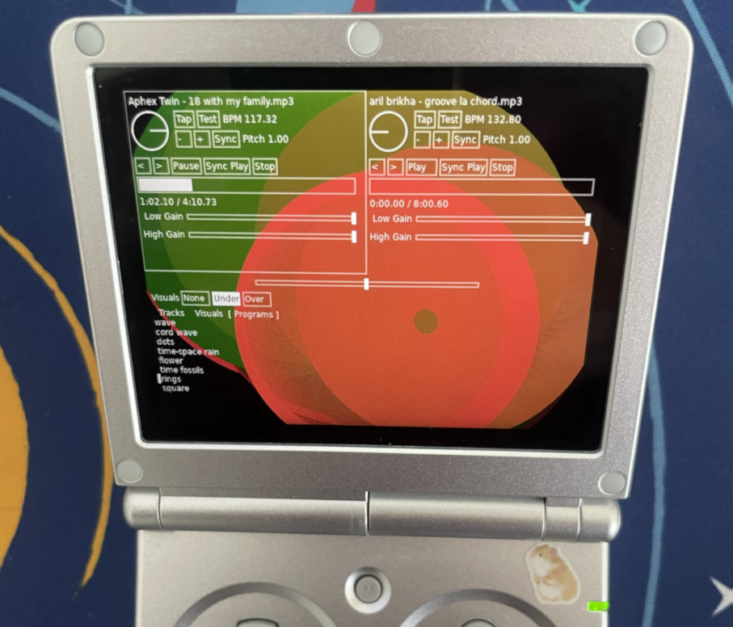
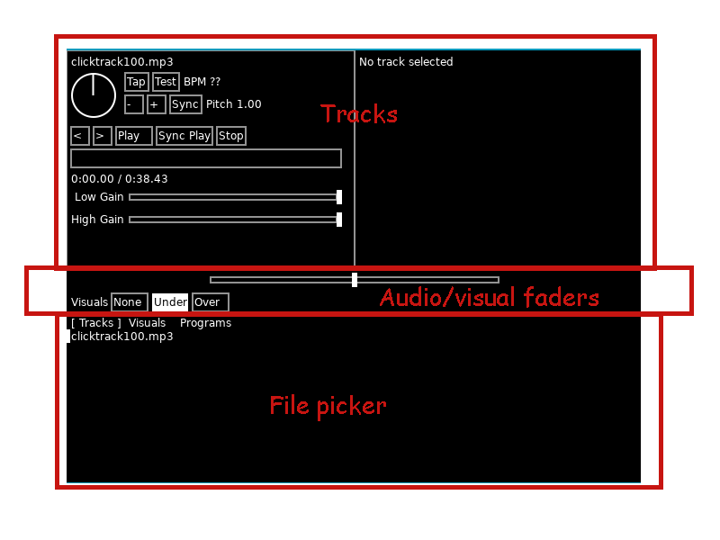

# DinoJam

DJ app for [MustardOS](muos.dev) handheld firmware, written using Lua and LÖVE. It includes a two channel mixer, a crossfader, BPM tapping/syncing, autoplay shuffle, and image/video/custom program support.

Tested on Mustard OS version `2601.1 Funky Jacaranda` and an Anbernic RG35XX SP.

## Installation and file management

You can find and download the latest release, along with installation instructions [here](https://github.com/Red-dino/dinojam/releases/tag/release).

### Adding music/visuals

The app only includes a 120 BPM click track and an ASCII art png to start. 

To add tracks, drop them in the `dinojam/tracks/` directory. Supported formats: mp3, ogg, oga, ogv, wav, flac.

To add visuals, drop them in the `dinojam/visuals/` directory. Supported formats: ogv, png, jpg, jpeg, bmp, tga, hdr, pic, exr.

Note that I have not personally tested all file formats, support is based on LÖVE's theoretical support for formats.

### Adding programs

Programs written in Lua can be added to `dinojam/main.lua`. Program are parameterless functions that can draw directly to the screen using the `love.graphics` API. The active program function is called once per frame. The program has its own canvas, so the canvas can be cleared/uncleared depending on the desired effect. Programs need to be named in the top-level `programs` variable, and then that name linked to the program function in the if-else block starting with `if program_name == "wave"`.

### Desktop

The app can also be used on desktop with LÖVE installed by running `love dinojam` in the root directory of the repository. On desktop, there's a one-to-one mapping of gamepad keys to keyboard keys. I include the keyboard keys in parentheses next to the gamepad keys throughout the rest of this readme.

### Updating song BPMs manually

I have trouble tapping BPMs because I'm rhymically challenged, which leads to poorly synced mixes. If you're like me, you can edit the BPMs directly in `data/love/dinojam/tracks.txt`. You must run the app and tap in a BPM for a song for it to appear in this file. The first value in each row is the name, then the BPM, then the time in seconds of a beat. I used the free VirtualDJ desktop software to collect this information for songs.

## Usage

### General navigation

- `d-pad` (arrow keys): Navigate
- `A` (space): Select options
- `start` (tab): Toggle autoplay
- `M` menu button: Exit
- `left bumper` and `right bumper` (Q and E): Switch between the left and right track at any time

### Shortcuts

- `X` (W): Jump to the play button of the current track
- `Y` (A): Jump to the first item in the current file menu
- `B` (D): Jump and switch to `Under` mode in the visual fader

### Tracks

- `Tap`: Tap `A` (space) on the beat to set and save the song's BPM. Navigating away from the button locks in that BPM such that returning to the button will start a fresh BPM calculation
- `Test`: Plays the song from the first tap to see if you got the timing right
- `-`: Decreases pitch 1%
- `+`: Increases pitch 1%
- `Sync`: Syncs the song's BPM to the song in the other track
- `<`: Rewind 5 seconds
- `>`: Fast-forward 5 seconds
- `Play`/`Pause`: Plays or pauses the song from the current location at the current pitch
- `Sync Play`: Plays the song, syncing the BPM and first beat of the measure to the other track
- `Stop`: Stops the song, returning to the beginning
- `Low Gain`: Gain of the low frequencies of the song. Pressing `A` (space) will jump the bar to 100% - current for quick cuts
- `High Gain`: Gain of the high frequencies of the song. Pressing `A` (space) will jump the bar to 100% - current for quick cuts

### Audio/visual fader

The audio fader lets you fade volume between the left and the right track. Pressing `A` (space) will jump the fader to the equivalent position for the other track (e.g. 20% left, 80% right becomes 80% left, 20% right) for quick cuts.

The visual fader lets you choose how the current visual/program is rendered.
- `None`: Hidden
- `Under`: Shown, but under the app menus
- `Over`: On top of app menus. Note you can still operate the app in this mode, so careful when clicking around

Press `B` (D) at any time to switch to `Under`, which is helpful if you're in `Over` mode and can't see the menus.

### File picker

- `Tracks`: Contains songs with name and BPM if recorded. Selecting a song will place it the currently selected track. This will stop an actively playing song on that track
- `Visuals`: Images and videos
- `Programs`: Lua-scripted programs

`(more)` will appear at the bottom if all the options can't be rendered at one time. In this case, you can scroll down.

### TODO

I only own an Anbernic RG35XX SP and I ahave limited DJing experience, so this app may be missing obvious things. There's still some low hanging fruit:

- Skip song: Skipping songs in autoplay mode
- Improve scrolling: I have some complicated logic to try to make scrolling speed up the longer you hold, but it doesn't work
- Analog joystick support: I have no idea if it works right now
- Return to 100% pitch: Right now, you can't return the pitch to exactly 100% after syncing
- Clean up the code: I've mostly implemented, I haven't done much refactoring
- Add more mixing tools: Like cross-fades with noise, flanging, etc. LÖVE has a lot of effects I haven't included yet!
- More cool programs: Increase the library of program visuals

## PRs

I'm happy to review and support pull requests that improve the app! This includes if you've written a cool program function you want included in the base version.

## Support

If you want to support me, follow me on [YouTube](youtube.com/@smalldosestudios) and my website [smalldose.net](smalldose.net). Thank you! :)
